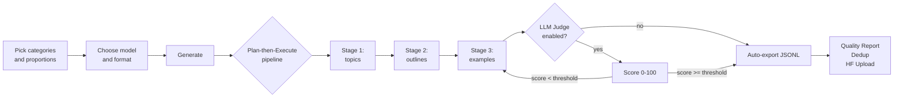

<div align="center">

<h1>
  
  &nbsp;Dataset Generator
</h1>

**A no-code desktop app for generating high-quality synthetic datasets to fine-tune LLMs.**

Pick categories, set proportions, click Generate — the app handles the rest: topic planning, example generation, quality scoring, and export to a ready-to-train JSONL file.

<br />

<!-- TODO: update badges once the project is on GitHub & CI is wired up -->


</div>

---

## Table of contents

- [About](#about)
- [Demo](#demo)
- [Key features](#key-features)
- [Tech stack](#tech-stack)
- [Requirements](#requirements)
- [Quick start](#quick-start)
- [Configuration](#configuration)
- [Usage workflow](#usage-workflow)
- [Architecture](#architecture)
- [Project structure](#project-structure)
- [Tests](#tests)
- [Roadmap](#roadmap)
- [License](#license)

---

## About

**Dataset Generator** solves a concrete problem: **building a high-quality fine-tuning dataset by hand takes weeks**. The app automates the entire pipeline — from topic planning, through multi-turn conversation generation, to quality validation, deduplication, and HuggingFace Hub upload.

Under the hood it runs a **Plan-then-Execute** engine: instead of a single "generate 100 examples" prompt, the app first decomposes the job into unique topics and outlines, only then generating the actual examples. The result: diverse, coherent data — without the repetitive patterns typical of naive generation.

The whole stack stays local: API keys are stored in SQLite **on the user's device**, datasets land in `~/.datasetgenerator/`. All model traffic goes through OpenRouter (~300 models, one key, one API).

The project is built as a portfolio piece and will be released as open source.

---

## Demo

<div align="center">

<!-- TODO: main GIF showcasing the full workflow (~30s):
     1. Pick categories and proportions
     2. Choose model and format
     3. Generate → live SSE dashboard
     4. Quality report + example preview
     Save under docs/assets/demo.gif (max 8 MB) -->


<br />
<sub>Generating 50 examples across 4 categories in ShareGPT format with the LLM Judge enabled — from clicking Generate to a finished .jsonl file.</sub>

</div>

---

## Key features

### Plan-then-Execute pipeline

Three-stage generation instead of a single prompt: **topics → outlines → examples**. Each stage can be assigned a different model (e.g. cheap Llama for topics, premium Claude for the actual examples).

<!-- TODO: docs/assets/feature-pipeline.png — screenshot of the 3 stages on the dashboard -->


### Per-category configuration

Create any number of categories (Frontend, Python, ML, Security, …) or pick from 10 built-in presets. Each category gets: a **proportion** (must sum to 100%), a **topic description** (instructs the LLM), and optionally a **dedicated model**.

<!-- TODO: docs/assets/feature-categories.png — view of category list with the proportion bar -->


### LLM Judge — automated quality scoring

A second model rates every generated example on a 0-100 scale against editable criteria (relevance, coherence, naturalness, educational value). Examples below the threshold are automatically rejected and the pipeline keeps generating until the target count is reached.

- Configurable threshold (0-100)
- Per-category fallback chain for the judge model
- 3 retries before skipping an example (`score=None` → skip, never auto-accept)

<!-- TODO: docs/assets/feature-judge.png — screenshot of an example with the score badge -->


### Real-time dashboard (SSE)

Server-Sent Events stream live progress: a global bar, per-category bars, judge stats (Evaluated / Accepted / Rejected), a live feed of the last 5 examples, running cost. No WebSockets, no client-side polling.

<!-- TODO: docs/assets/feature-dashboard.gif — short clip (~10s) of the live dashboard during generation -->


### Three export formats

**ShareGPT**, **Alpaca**, **ChatML** — switchable in one click. JSONL export written locally, ready to feed any trainer (Axolotl, Unsloth, LLaMA-Factory, custom).

### Multi-turn conversations (1-5 turns)

Generate simple Q&A pairs or long multi-turn conversations. The full conversation is generated in a single LLM call — models keep context coherent throughout.

### Cost tracking — actual costs

The app pulls the real `usage` (prompt + completion tokens) from every OpenRouter response and multiplies by the live per-category pricing. No guessing — you see exactly what each job cost.

### Reasoning models support

Special handling for reasoning models (Qwen3, Gemma 4, Devstral) — `max_tokens` is multiplied ×2 on the API side to leave room for the model's "thinking", while the user-facing limit is enforced on the actual content.

### Embedding-based deduplication

Find semantic duplicates among generated examples (cosine similarity over OpenRouter embeddings). Remove duplicates from the dataset in one click.

<!-- TODO: docs/assets/feature-dedup.png — dedup modal screenshot -->


### Quality Report

Full quality breakdown for the dataset: judge score histogram, token statistics per category, generation efficiency, mean/median scores. Exportable to JSON/CSV.

<!-- TODO: docs/assets/feature-quality.png — Quality Report modal -->


### Dataset history + in-app preview

A `/history` page with every generated dataset, status, and cost. Click any job → split-view with a preview of every example, turn-by-turn parsing, and code-block highlighting (no heavy deps like Prism).

<!-- TODO: docs/assets/feature-history.png — /history page with the job list -->


### Dataset merging

Combine multiple jobs into a single dataset (badge **Merged**). All features (preview, report, dedup, HF upload) work the same on merged jobs.

### HuggingFace Hub upload

When generation finishes, click Upload → configure repo (name, private/public) → JSONL goes straight to Hugging Face. The HF token is stored locally in SQLite.

<!-- TODO: docs/assets/feature-hf-upload.gif — HF upload clip (~5s) -->


---

## Tech stack

| Layer | Technologies |
|---|---|
| **Frontend** | Next.js 16, React 19, TypeScript, Tailwind CSS v4, Shadcn UI, [@base-ui/react](https://base-ui.com/), Lucide icons |
| **Backend** | FastAPI, Python 3.10+, Pydantic v2, aiosqlite, httpx, tiktoken, numpy, huggingface_hub |
| **Database** | SQLite (local, in user's data directory) |
| **Real-time** | Server-Sent Events (SSE) — no WebSockets |
| **LLM API** | OpenRouter (unified access to ~300 models) |
| **Embeddings** | OpenRouter Embeddings API + numpy cosine similarity |
| **Desktop runtime** *(planned)* | Pywebview + PyInstaller `--onedir` |

### Architectural decisions worth noting

- **Pywebview over Electron** — single runtime (Python), no Node.js to bundle, the final app ships **several times smaller**.
- **SSE over WebSocket** — sufficient for a one-way progress stream, simpler, no extra dependencies.
- **tiktoken (cl100k_base) as a universal approximation** — with a 10% safety margin, no need to fetch a per-model tokenizer.
- **Numpy cosine instead of scikit-learn TF-IDF** — faster, lighter, and embeddings beat lexical similarity anyway.
- **No ORM** — plain `aiosqlite` with parameterized queries; faster, less magic.

---

## Requirements

- **Python 3.10+** (with `venv`)
- **Node.js 20+** (with `npm`)
- **OpenRouter API key** ([get one here](https://openrouter.ai/keys))
- *(optional)* **HuggingFace token** for dataset uploads

---

## Quick start

### 1. Clone the repo

```bash
git clone https://github.com/<your-username>/dataset-generator.git
cd dataset-generator
```

### 2. Backend

```bash
cd backend
python3 -m venv venv
./venv/bin/pip install -r requirements.txt
./venv/bin/uvicorn app.main:app --reload --port 8000
```

The backend starts on `http://localhost:8000`. Swagger UI is available at `http://localhost:8000/docs`.

### 3. Frontend

In a new terminal:

```bash
cd frontend
npm install
npm run dev
```

The frontend starts on `http://localhost:3000`. Open it in your browser.

### 4. First dataset

1. Click **Settings** → enter your OpenRouter API key → Save
2. Pick a model in the **Generation settings** section
3. Choose a preset category (e.g. *Python*) or create your own
4. Set the example count (slider) and format (ShareGPT/Alpaca/ChatML)
5. Click **Generate**
6. When it finishes — **Open folder** or **View** to preview in-app

<!-- TODO: docs/assets/quickstart.gif — clip from blank screen to first dataset (~20s) -->


---

## Configuration

All settings are managed from the UI (the **Settings** modal, gear icon).

### Settings sections

- **API Keys** — OpenRouter key, HuggingFace token; each with a disclaimer about local storage
- **Generation** — default model, request delay, retry count, retry cooldown
- **Judge** — enable/disable LLM Judge, judge model, acceptance threshold, editable evaluation criteria
- **Dedup** — embedding model (default: `openai/text-embedding-3-small`)

### User data location

| OS | Path |
|---|---|
| Linux/macOS | `~/.datasetgenerator/` |
| Windows | `%APPDATA%/DatasetGenerator/` |

Layout:

```
~/.datasetgenerator/
├── database.sqlite       # settings, keys, jobs, examples
└── datasets/
    ├── <job_id>.jsonl    # exported datasets
    └── ...
```

---

## Usage workflow



---

## Architecture

```
┌─────────────────────────────────────────────────────────────┐
│  Next.js (port 3000 dev / static export prod)               │
│  ┌──────────────┐  ┌─────────────┐  ┌────────────────┐      │
│  │ Generator UI │  │ Dashboard   │  │ History/Detail │      │
│  └──────┬───────┘  └──────┬──────┘  └────────┬───────┘      │
└─────────┼─────────────────┼──────────────────┼──────────────┘
          │ fetch /api/*    │ EventSource SSE  │
          ▼                 ▼                  ▼
┌─────────────────────────────────────────────────────────────┐
│  FastAPI (port 8000)                                        │
│  ┌──────────┐ ┌──────────┐ ┌─────────┐ ┌──────────────┐     │
│  │ /jobs    │ │ /settings│ │ /open-  │ │ /datasets    │     │
│  │ + SSE    │ │          │ │ router  │ │ open-folder  │     │
│  └────┬─────┘ └──────────┘ └─────────┘ └──────────────┘     │
│       │                                                     │
│       ▼                                                     │
│  ┌────────────────────────────────────────────────────┐     │
│  │ services/                                          │     │
│  │  job_runner • prompt_builder • openrouter_client   │     │
│  │  token_counter • export_service • dedup_service    │     │
│  │  embedding_service • hf_service                    │     │
│  └────────────────────────────────────────────────────┘     │
│       │                          │                          │
│       ▼                          ▼                          │
│  ┌─────────────┐          ┌──────────────────┐              │
│  │ SQLite      │          │ OpenRouter API   │              │
│  │ (aiosqlite) │          │ (httpx async)    │              │
│  └─────────────┘          └──────────────────┘              │
└─────────────────────────────────────────────────────────────┘
```

---

## Project structure

```
pipeline/
├── backend/
│   ├── app/
│   │   ├── main.py                  # FastAPI entrypoint, lifespan, CORS
│   │   ├── config.py                # paths, CORS origins
│   │   ├── utils.py                 # helpers (api key fetch, ISO timestamps)
│   │   ├── database/
│   │   │   ├── connection.py        # aiosqlite singleton
│   │   │   └── migrations.py        # versioned migrations (v1-v4)
│   │   ├── models/
│   │   │   └── jobs.py              # Pydantic: JobConfig, ProgressJson, ...
│   │   ├── routers/
│   │   │   ├── health.py
│   │   │   ├── settings.py          # API keys, HF token, global config
│   │   │   ├── openrouter.py        # /models, /test, /embedding-models
│   │   │   ├── jobs.py              # CRUD + SSE + export + dedup + stats
│   │   │   └── datasets.py          # open-folder
│   │   └── services/
│   │       ├── job_runner.py        # pipeline engine (Plan-then-Execute)
│   │       ├── prompt_builder.py    # 3 prompt types × 3 formats
│   │       ├── openrouter_client.py # async httpx with retry
│   │       ├── token_counter.py     # tiktoken + safety margin
│   │       ├── export_service.py    # JSONL export
│   │       ├── dedup_service.py     # cosine similarity duplicates
│   │       ├── embedding_service.py # OpenRouter embeddings
│   │       └── hf_service.py        # HuggingFace Hub upload
│   └── requirements.txt
├── frontend/
│   ├── src/
│   │   ├── app/
│   │   │   ├── layout.tsx           # root layout (Plus Jakarta Sans)
│   │   │   ├── page.tsx             # generator
│   │   │   ├── history/page.tsx     # dataset list
│   │   │   └── jobs/[id]/page.tsx   # dataset preview (split view)
│   │   ├── components/
│   │   │   ├── generator/           # CategoryList, GlobalControls, ...
│   │   │   ├── settings/            # SettingsDialog + sections
│   │   │   ├── jobs/                # DeduplicateModal, QualityReportModal
│   │   │   ├── history/             # UploadHfModal
│   │   │   └── ui/                  # button, card, slider, select, ...
│   │   └── lib/
│   │       ├── api.ts               # fetch wrappers + types
│   │       ├── proportions.ts       # category proportion logic
│   │       ├── example-utils.ts     # turn-by-turn parser
│   │       └── provider-icons.ts    # modelId → provider icon map
│   └── package.json
├── tests/
│   ├── unit/                        # 7 files: dedup, embedding, hf, ...
│   ├── integration/                 # 9 files: jobs, settings, export, ...
│   └── e2e/                         # 3 files: full pipeline scenarios
├── plan_projektu.md                 # full project plan (PL)
└── README.md
```

---

## Tests

The suite ships **270+ tests** (unit + integration + e2e).

```bash
cd backend
./venv/bin/pip install -r ../tests/requirements-test.txt
./venv/bin/pytest ../tests/                        # all
./venv/bin/pytest ../tests/unit/                   # unit only
./venv/bin/pytest ../tests/integration/ -v         # integration verbose
./venv/bin/pytest ../tests/e2e/ -k "judge"         # specific scenario
```

---

## Roadmap

- [x] **Phases 0-5** — full generation pipeline + LLM Judge + SSE
- [x] **History + dataset preview**
- [x] **HuggingFace Hub upload**
- [x] **Embedding-based deduplication**
- [x] **Quality Report**
- [x] **Dataset merging**
- [x] **Cost tracking (real usage)**
- [ ] **Phase 6** — desktop bundle (Pywebview + PyInstaller `--onedir`)
- [ ] **Phase 7** — auto-update + new-version checks
- [ ] **Phase 8** — dataset templates (community-contributed)
- [ ] **Local models** — Ollama / llama.cpp support as an OpenRouter alternative

---

## License

**GNU Affero General Public License v3.0** — see [LICENSE](LICENSE).

The AGPL-3.0 is a strong copyleft license: you are free to use, modify, and redistribute Dataset Generator, but **any derivative work — including SaaS / network-deployed versions — must release its full source code under the same license**. This is intentional, to keep the project and any downstream variants open source.

If you need a different licensing arrangement (e.g. for proprietary commercial use), please open an issue to discuss.

---

<div align="center">
<sub>Built with React, FastAPI, and a healthy dose of stubbornness.</sub>
</div>
