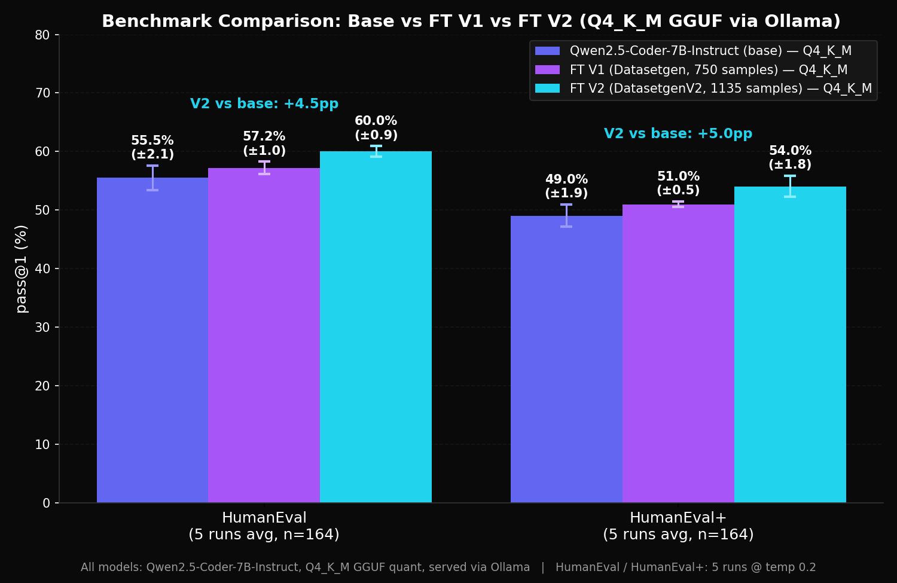

<div align="center">


# Dataset Generator

**A no-code desktop app for generating high-quality synthetic datasets to fine-tune LLMs.**

Pick categories, set proportions, click Generate — the app handles topic planning, example generation, quality scoring, and export to a ready-to-train JSONL file.

[](#quick-start)
[](https://www.python.org/)
[](https://nodejs.org/)
[](LICENSE)
[](https://ko-fi.com/arondaron)

</div>

---

## About

Dataset Generator is a desktop app that automates the full dataset generation pipeline — topic planning, multi-turn conversation generation, quality validation via LLM Judge, deduplication, and HuggingFace Hub upload. No scripts to write, no ML infra to configure.

Under the hood it runs a three-stage engine: instead of a single "generate 100 examples" prompt, the app first decomposes the job into unique topics and outlines, only then generating the actual examples. The result: diverse, coherent data without the repetitive patterns of naive generation.

Everything stays local. API keys live in SQLite on your device, datasets land in `~/.datasetgenerator/`. Talk to OpenRouter for ~300 cloud models, or point the app at a local Ollama / LM Studio / llama.cpp server for fully offline generation — both modes share the same pipeline.

> **Note on provider terms.** Users are responsible for complying with the terms of service of the LLM providers they use through OpenRouter. Some providers restrict using model outputs for training competitive models — check the ToS of your chosen model before generating datasets for fine-tuning.

---

## Why I built this

I recently started fine-tuning open-source LLMs as a hobby, and build software with AI coding agents. I wanted a simple way to generate training datasets without writing custom scripts every time — pick categories, configure the pipeline, click Generate, get a JSONL ready for training. There's plenty of datasets on HuggingFace, but sometimes you want one tailored to your specific categories and proportions. So I built the tool I wanted to use.

---

## Benchmark

Datasets generated by this app were used to fine-tune **Qwen2.5-Coder-7B-Instruct** and evaluated against the base model on **HumanEval / HumanEval+** (pass@1, average across 5 runs). **Every model in the pipeline — topic planner, example generator, and LLM Judge — was open-source** (Llama, Qwen, DeepSeek, Mistral via OpenRouter). No proprietary APIs.

<div align="center">

| Model | HumanEval | HumanEval+ |
|---|:---:|:---:|
| Base Qwen2.5-Coder-7B-Instruct | 55.5% (±2.1) | 49.0% (±1.9) |
| FT V1 (750 samples) | 57.2% (±1.0) | 51.0% (±0.5) |
| **FT V2 (this pipeline, 1135 samples)** | **60.0% (±0.9)** | **54.0% (±1.8)** |

</div>

**+4.5 pts on HumanEval, +5.0 pts on HumanEval+ vs base.** Error bars don't overlap — the difference is statistically significant.

🤗 **Artifacts:** [fine-tuned model](https://huggingface.co/AronDaron/Qwen2.5-Coder-7B-Instruct-DatasetGen-v2) · [V1 dataset (750 samples)](https://huggingface.co/datasets/AronDaron/dataset-gen-v1) · [V2 dataset (1135 samples)](https://huggingface.co/datasets/AronDaron/dataset-gen-v2)

<div align="center">

</div>

<sub>This benchmark validates the pipeline on a coding-focused dataset (multi-turn 
coding assistance with explanations). The tool itself is domain-agnostic — define 
any categories (writing, Q&A, math, customer support, etc.) and the same workflow 
applies. Results depend on category configuration, judge criteria, and model 
selection — your mileage may vary.</sub>

---

## Demo

<div align="center">

https://github.com/user-attachments/assets/73f43f6c-a5b8-47c9-8de2-8e016e57cfef

<sub>Generating 10 examples across 2 categories in ShareGPT format with the LLM Judge enabled.</sub>

</div>

---

## Features

> Actively developed — bug reports and feature requests welcome via [Issues](../../issues).
> General questions and ideas → [Discussions](../../discussions).


- **Plan-then-Execute pipeline** — three stages (topics → outlines → examples), each can use a different model
- **Tests** - 460-test suite (unit + integration + E2E) — internal
- **Cloud + local providers** — OpenRouter for ~300 cloud models, plus Ollama / LM Studio / any OpenAI-compatible endpoint for fully offline generation. Mix and match per category (e.g. local generator + cloud judge).
- **Per-category configuration** — any number of categories with custom proportions, descriptions, and dedicated models
- **LLM Judge** — a second model scores every example 0–100 against editable criteria; rejected examples are regenerated
- **Real-time SSE dashboard** — global and per-category progress, live example feed, running cost
- **Three export formats** — ShareGPT, Alpaca, ChatML
- **Multi-turn conversations** — 1–5 turns generated coherently in one LLM call
- **Actual cost tracking** — pulls real `usage` tokens from every response, multiplies by live pricing
- **Embedding-based deduplication** — cosine similarity over OpenRouter embeddings
- **Quality Report** — judge histogram, token stats, efficiency, export to JSON/CSV
- **Dataset history + in-app preview** — turn-by-turn rendering, code highlighting, dataset merging
- **HuggingFace Hub upload** — one-click push to your repo


---

## Use cases

- **Fine-tuning a domain-specific assistant** — coding, legal, medical, customer support. The benchmark above is exactly this flow.
- **Instruction datasets at any scale** — SFT-ready JSONL for models from 7B edge deployments up to 70B+; merge multiple jobs to grow the corpus.
- **Experimenting with fine-tuning** — quickly test how different category compositions affect model behavior without weeks of data curation.
- **Multi-turn conversation datasets** — generate 3–5 turn dialogues for training agentic behaviors.

---

## Local models (Ollama / LM Studio / OpenAI-compatible)

Beyond OpenRouter cloud models, the app talks to any **OpenAI-compatible** endpoint — Ollama, LM Studio, llama.cpp, vLLM, TGI, or your own server. Run the entire pipeline offline, or mix freely: e.g. local generator + cloud judge, or different models per category.

**Setup:** start your local server (`ollama serve` on port 11434, LM Studio's server tab on 1234, etc.), then in the app open **Settings → Providers → Auto-detect local**. Endpoints are discovered automatically; any custom base URL of the form `http://host:port/v1` also works. For fully offline runs, pick a local embedding model (e.g. `nomic-embed-text`) in **Settings → Dedup**.

### Model size matters

Dataset generation is more demanding than general chat — the model has to produce strict JSON, follow multi-turn structure, and stay coherent across many examples. A model that's perfectly fine for chat may fail validation here.

| Size | Recommendation | Notes |
|---|---|---|
| **<7B** (Llama 3.2:3B, etc.) | Not recommended | Frequent JSON validation failures, repetitive content, schema drift |
| **7B–13B** (Mistral 7B, Llama 3.1:8B) | Casual use only | Works for experimentation, but expect noticeable skip rate and lower diversity |
| **14B** (Qwen2.5-Coder:14B, Qwen3:14B) | Pragmatic minimum | Stable generation, clean output, low skip rate |
| **32B+** (Qwen2.5-Coder-32B, DeepSeek-V3, GLM-4-32B) | Recommended target | Quality approaches cloud providers |

If you don't have the GPU for 14B+, **OpenRouter is the better path** — same pipeline, no hardware constraint, open-source models cost cents per 1000 examples.

---

## Download

Pre-built binaries are on the [Releases](../../releases) page — no Python, no Node.js required.

| Platform | File | Size | Usage |
|---|---|---|---|
| Windows 10/11 (x64) | `DatasetGenerator-windows-x64.zip` | ~100 MB | Extract → double-click `DatasetGenerator.exe` |
| Linux (AppImage) | `DatasetGenerator-x86_64.AppImage` | ~140 MB | `chmod +x` → double-click |
| Linux (tar.gz) | `DatasetGenerator-linux-x64.tar.gz` | ~140 MB | Extract → run `./DatasetGenerator` |

<details>
<summary><b>Windows — SmartScreen warning</b></summary>

Unsigned executable: on first run click **More info** → **Run anyway**. App data is stored in `%APPDATA%\DatasetGenerator\`.
</details>

<details>
<summary><b>Linux AppImage — FUSE on Ubuntu 24.04</b></summary>

```bash
chmod +x DatasetGenerator-x86_64.AppImage
./DatasetGenerator-x86_64.AppImage
```

If `dlopen(): error loading libfuse.so.2` appears:
```bash
sudo apt install libfuse2t64   # Ubuntu 24.04+
sudo apt install libfuse2      # Ubuntu 22.04 and older
```
</details>

<details>
<summary><b>Linux tar.gz — GTK/WebKit requirements</b></summary>

```bash
tar -xzf DatasetGenerator-linux-x64.tar.gz
cd DatasetGenerator
./DatasetGenerator
```

Requires GTK 3 and WebKit2GTK 4.1 (pre-installed on Ubuntu 24.04+, Fedora 38+). On older systems:
```bash
sudo apt install libgtk-3-0 libwebkit2gtk-4.1-0
```
</details>

---

## Quick start

```bash
git clone https://github.com/AronDaron/dataset-generator.git
cd dataset-generator

# Backend
cd backend
python3 -m venv venv
./venv/bin/pip install -r requirements.txt
./venv/bin/uvicorn app.main:app --reload --port 8000

# Frontend (new terminal)
cd frontend
npm install
npm run dev
```

Backend on `http://localhost:8000`, frontend on `http://localhost:3000`. Open Settings → enter your OpenRouter API key → pick a category → click Generate.

> **Windows:** replace `./venv/bin/pip` and `./venv/bin/uvicorn` with `venv\Scripts\pip.exe` and `venv\Scripts\uvicorn.exe`.

**Requirements:** Python 3.10+, Node.js 20+, an [OpenRouter API key](https://openrouter.ai/keys).

**Stack:** Next.js 16 + React 19, FastAPI + Pydantic v2, SQLite (aiosqlite), SSE for progress, Pywebview + PyInstaller for packaging.

---

## FAQ

**Is Linux fully supported?**
Yes — the app ships AppImage and tar.gz builds and all features work cross-platform. That said, day-to-day development and manual testing happens on Windows; Linux builds are verified with automated smoke tests but don't get the same amount of hands-on time. If something feels off on Linux, please open an Issue — I'll take a look.

**How much does it cost to generate 1000 examples?**
Depends on model choice, turn count, and judge strictness. With open-source models available on OpenRouter (Llama 3.x, Qwen 2.5, DeepSeek, Mistral) expect single-digit dollars per 1000 multi-turn examples. Note that the UI shows the cost of accepted examples only — real spend includes rejected and skipped examples plus retries, typically 1.5-2x the displayed cost depending on judge threshold.

**Is my API key safe?**
Keys are stored locally in SQLite (`~/.datasetgenerator/database.sqlite`). No telemetry, no remote calls except to OpenRouter and (optionally) HuggingFace Hub. Nothing leaves your machine unless you push a dataset.

**Why AGPL-3.0 and not MIT?**
To prevent closed-source SaaS forks. You're free to use, modify, and self-host — but if you deploy a derivative as a hosted service, your users have the right to receive your source code. Commercial licensing is negotiable — open an Issue or contact me directly.

---

## License

**GNU Affero General Public License v3.0** — see [LICENSE](LICENSE).

Strong copyleft: you're free to use, modify, and redistribute, but any derivative work — including SaaS / network-deployed versions — must release its full source under the same license. For proprietary commercial use, open an issue or contact me directly.
