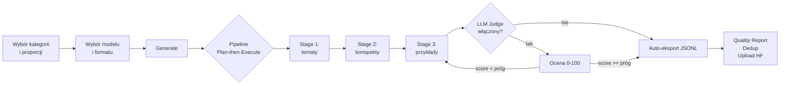

<div align="center">

<!-- TODO: dodaj logo aplikacji w docs/assets/logo.png (sugerowany rozmiar 200x200) -->


# Dataset Generator

**Desktopowa aplikacja no-code do generowania syntetycznych datasetów do fine-tuningu modeli LLM.**

Wybierz kategorie, ustaw proporcje, kliknij Generate — aplikacja zajmie się resztą: planowaniem tematów, generowaniem przykładów, oceną jakości i eksportem do gotowego pliku JSONL.

<br />

<!-- TODO: zaktualizuj badge'e gdy projekt trafi na GitHub i CI -->


<br />

<!-- TODO: hero screenshot z głównego widoku generatora — docs/assets/hero.png -->


</div>

---

## Spis treści

- [O projekcie](#o-projekcie)
- [Demo](#demo)
- [Kluczowe funkcje](#kluczowe-funkcje)
- [Stack technologiczny](#stack-technologiczny)
- [Wymagania](#wymagania)
- [Szybki start](#szybki-start)
- [Konfiguracja](#konfiguracja)
- [Workflow użycia](#workflow-użycia)
- [Architektura](#architektura)
- [Struktura projektu](#struktura-projektu)
- [Testy](#testy)
- [Roadmap](#roadmap)
- [Licencja](#licencja)

---

## O projekcie

**Dataset Generator** rozwiązuje konkretny problem: **ręczne tworzenie wysokiej jakości danych do fine-tuningu modeli LLM zajmuje tygodnie**. Aplikacja automatyzuje cały pipeline — od planowania tematów, przez generację multi-turn rozmów, po walidację jakości, deduplikację i upload na HuggingFace Hub.

Pod maską działa silnik **Plan-then-Execute**: zamiast jednego "wygeneruj 100 przykładów" promptu, aplikacja najpierw rozbija zadanie na unikalne tematy i konspekty, a dopiero potem generuje właściwe przykłady. Efektem są zróżnicowane, spójne dane — bez powtarzających się wzorców typowych dla naiwnej generacji.

Cały stack jest lokalny: klucze API zapisywane w SQLite **na urządzeniu użytkownika**, datasety w `~/.datasetgenerator/`. Komunikacja z modelami idzie wyłącznie przez OpenRouter (~300 modeli, jeden klucz, jedno API).

Projekt powstaje jako element portfolio i będzie udostępniony jako open source.

---

## Demo

<div align="center">

<!-- TODO: główny GIF demonstrujący pełen workflow (~30s):
     1. Wybór kategorii i proporcji
     2. Wybór modelu i formatu
     3. Generate → live SSE dashboard
     4. Quality report + podgląd przykładów
     Zapisz w docs/assets/demo.gif (max 8 MB) -->


<br />
<sub>Generacja 50 przykładów z 4 kategorii w formacie ShareGPT z LLM Judge — od kliknięcia Generate do gotowego pliku .jsonl.</sub>

</div>

---

## Kluczowe funkcje

### Pipeline Plan-then-Execute

Trzy-etapowa generacja zamiast jednego promptu: **tematy → konspekty → przykłady**. Każdy etap można zlecić innemu modelowi (np. tani Llama do tematów, droższy Claude do właściwych przykładów).

<!-- TODO: docs/assets/feature-pipeline.png — screenshot 3 etapów na dashboardzie -->


### Kategorie z indywidualną konfiguracją

Stwórz dowolną liczbę kategorii (Frontend, Python, ML, Security, …) lub użyj 10 gotowych presetów. Dla każdej kategorii ustawiasz: **proporcję** (sumująca się do 100%), **opis tematyczny** (instruuje LLM), opcjonalnie **dedykowany model**.

<!-- TODO: docs/assets/feature-categories.png — widok listy kategorii z paskiem proporcji -->


### LLM Judge — automatyczna ocena jakości

Drugi model ocenia każdy wygenerowany przykład w skali 0-100 wg zdefiniowanych kryteriów (relevance, coherence, naturalness, educational value — edytowalne). Przykłady poniżej progu są automatycznie odrzucane, a pipeline kontynuuje aż do osiągnięcia targetu.

- Konfigurowalny próg (0-100)
- Per-category fallback chain dla modelu sędziego
- 3 retry przed pominięciem przykładu (`score=None` → skip, nigdy auto-accept)

<!-- TODO: docs/assets/feature-judge.png — screenshot przykładu z badge score -->


### Real-time dashboard (SSE)

Server-Sent Events przekazują postęp na żywo: globalny pasek, paski per kategoria, statystyki sędziego (Evaluated / Accepted / Rejected), live feed ostatnich 5 przykładów, koszt narastający. Bez WebSocketów, bez pollingu po stronie klienta.

<!-- TODO: docs/assets/feature-dashboard.gif — krótki gif (~10s) live dashboardu w trakcie generacji -->


### Trzy formaty eksportu

**ShareGPT**, **Alpaca**, **ChatML** — wybierane jednym klikiem. Eksport JSONL zapisany lokalnie, gotowy do podania trenerowi (Axolotl, Unsloth, LLaMA-Factory, custom).

### Multi-turn conversations (1-5 tur)

Generuj proste pary Q&A albo długie konwersacje wieloturowe. Cała rozmowa generowana w jednym wywołaniu LLM — modele utrzymują spójność kontekstu.

### Cost tracking — realne koszty

Aplikacja pobiera realne `usage` (prompt + completion tokens) z każdej odpowiedzi OpenRouter i mnoży przez aktualne ceny per kategoria. Brak strzelania promiltami — widzisz dokładnie ile kosztował każdy job.

### Reasoning models support

Specjalna obsługa modeli reasoningowych (Qwen3, Gemma 4, Devstral) — `max_tokens` mnożone × 2 dla LLM-owego "myślenia", a limit użytkownika egzekwowany na właściwym contencie.

### Deduplikacja embedding-based

Sprawdź który z wygenerowanych przykładów to duplikaty semantyczne (cosine similarity na embeddingach z OpenRouter). Jednym klikiem usuń duplikaty z datasetu.

<!-- TODO: docs/assets/feature-dedup.png — screenshot modala deduplikacji -->


### Quality Report

Pełny raport jakości datasetu: histogram ocen sędziego, statystyki tokenów per kategoria, generation efficiency, średnia/mediana scoreów. Eksport do JSON/CSV.

<!-- TODO: docs/assets/feature-quality.png — modal Quality Report -->


### Historia datasetów + podgląd w aplikacji

Strona `/history` z listą wszystkich wygenerowanych datasetów, statusami, kosztami. Klik w job → split-view z podglądem każdego przykładu, parsowaniem turn-by-turn, kolorowaniem code blocków (bez ciężkich bibliotek typu Prism).

<!-- TODO: docs/assets/feature-history.png — strona /history z listą jobów -->


### Merge datasetów

Połącz kilka jobów w jeden dataset (badge **Merged**). Wszystkie funkcje (podgląd, raport, dedup, upload HF) działają tak samo jak na zwykłych jobach.

### Upload na HuggingFace Hub

Po zakończeniu kliknij Upload → konfiguracja repo (nazwa, prywatne/publiczne) → JSONL trafia bezpośrednio na Hugging Face. Token HF zapisywany lokalnie w SQLite.

<!-- TODO: docs/assets/feature-hf-upload.gif — gif uploadu na HF (~5s) -->


---

## Stack technologiczny

| Warstwa | Technologie |
|---|---|
| **Frontend** | Next.js 16, React 19, TypeScript, Tailwind CSS v4, Shadcn UI, [@base-ui/react](https://base-ui.com/), Lucide icons |
| **Backend** | FastAPI, Python 3.10+, Pydantic v2, aiosqlite, httpx, tiktoken, numpy, huggingface_hub |
| **Baza danych** | SQLite (lokalna, w katalogu danych użytkownika) |
| **Real-time** | Server-Sent Events (SSE) — bez WebSocketów |
| **LLM API** | OpenRouter (zunifikowany dostęp do ~300 modeli) |
| **Embeddings** | OpenRouter Embeddings API + numpy cosine similarity |
| **Desktop runtime** *(planowane)* | Pywebview + PyInstaller `--onedir` |

### Decyzje architektoniczne warte odnotowania

- **Pywebview zamiast Electron** — jeden runtime (Python), bez bundlowania Node.js, finalna aplikacja **kilkukrotnie mniejsza**.
- **SSE zamiast WebSocketu** — wystarczające dla jednokierunkowego streamu progresu, prostsze, bez dodatkowych zależności.
- **tiktoken (cl100k_base) jako aproksymacja dla wszystkich modeli** — z 10% marginesem bezpieczeństwa, nie wymaga pobierania per-model tokenizatora.
- **Numpy cosine zamiast scikit-learn TF-IDF** — szybsze, lżejsze, embeddingi i tak są lepsze semantycznie.
- **Brak ORM** — czysty `aiosqlite` z parametrized queries; szybciej, mniej magii.

---

## Wymagania

- **Python 3.10+** (z `venv`)
- **Node.js 20+** (z `npm`)
- **Klucz API OpenRouter** ([uzyskaj tutaj](https://openrouter.ai/keys))
- *(opcjonalnie)* **Token HuggingFace** dla uploadu datasetów

---

## Szybki start

### 1. Klonowanie repozytorium

```bash
git clone https://github.com/<your-username>/dataset-generator.git
cd dataset-generator
```

### 2. Backend

```bash
cd backend
python3 -m venv venv
./venv/bin/pip install -r requirements.txt
./venv/bin/uvicorn app.main:app --reload --port 8000
```

Backend wystartuje na `http://localhost:8000`. Swagger UI dostępne na `http://localhost:8000/docs`.

### 3. Frontend

W nowym terminalu:

```bash
cd frontend
npm install
npm run dev
```

Frontend wystartuje na `http://localhost:3000`. Otwórz w przeglądarce.

### 4. Pierwszy dataset

1. Kliknij **Settings** → wprowadź klucz OpenRouter API → Save
2. Wybierz model w sekcji **Generation settings**
3. Wybierz preset kategorii (np. *Python*) lub stwórz własną
4. Ustaw liczbę przykładów (suwak) i format (ShareGPT/Alpaca/ChatML)
5. Kliknij **Generate**
6. Po zakończeniu — **Open folder** lub **View** dla podglądu w aplikacji

<!-- TODO: docs/assets/quickstart.gif — gif od pustego ekranu do pierwszego datasetu (~20s) -->


---

## Konfiguracja

Wszystkie ustawienia zarządzane są z poziomu UI (modal **Settings**, ikona koła zębatego).

### Sekcje ustawień

- **API Keys** — klucz OpenRouter, token HuggingFace; każdy z disclaimerem o lokalnym przechowywaniu
- **Generation** — domyślny model, delay między requestami, retry count, retry cooldown
- **Judge** — włącz/wyłącz LLM Judge, wybór modelu sędziego, próg akceptacji, edytowalne kryteria oceny
- **Dedup** — model embedding (default: `openai/text-embedding-3-small`)

### Lokalizacja danych użytkownika

| System | Ścieżka |
|---|---|
| Linux/macOS | `~/.datasetgenerator/` |
| Windows | `%APPDATA%/DatasetGenerator/` |

Struktura:

```
~/.datasetgenerator/
├── database.sqlite       # ustawienia, klucze, joby, examples
└── datasets/
    ├── <job_id>.jsonl    # wyeksportowane datasety
    └── ...
```

---

## Workflow użycia



---

## Architektura

```
┌─────────────────────────────────────────────────────────────┐
│  Next.js (port 3000 dev / static export prod)               │
│  ┌──────────────┐  ┌─────────────┐  ┌────────────────┐      │
│  │ Generator UI │  │ Dashboard   │  │ History/Detail │      │
│  └──────┬───────┘  └──────┬──────┘  └────────┬───────┘      │
└─────────┼─────────────────┼──────────────────┼──────────────┘
          │ fetch /api/*    │ EventSource SSE  │
          ▼                 ▼                  ▼
┌─────────────────────────────────────────────────────────────┐
│  FastAPI (port 8000)                                        │
│  ┌──────────┐ ┌──────────┐ ┌─────────┐ ┌──────────────┐     │
│  │ /jobs    │ │ /settings│ │ /open-  │ │ /datasets    │     │
│  │ + SSE    │ │          │ │ router  │ │ open-folder  │     │
│  └────┬─────┘ └──────────┘ └─────────┘ └──────────────┘     │
│       │                                                     │
│       ▼                                                     │
│  ┌────────────────────────────────────────────────────┐     │
│  │ services/                                          │     │
│  │  job_runner • prompt_builder • openrouter_client   │     │
│  │  token_counter • export_service • dedup_service    │     │
│  │  embedding_service • hf_service                    │     │
│  └────────────────────────────────────────────────────┘     │
│       │                          │                          │
│       ▼                          ▼                          │
│  ┌─────────────┐          ┌──────────────────┐              │
│  │ SQLite      │          │ OpenRouter API   │              │
│  │ (aiosqlite) │          │ (httpx async)    │              │
│  └─────────────┘          └──────────────────┘              │
└─────────────────────────────────────────────────────────────┘
```

---

## Struktura projektu

```
pipeline/
├── backend/
│   ├── app/
│   │   ├── main.py                  # FastAPI entrypoint, lifespan, CORS
│   │   ├── config.py                # ścieżki, CORS origins
│   │   ├── utils.py                 # helpery (api key fetch, ISO timestamps)
│   │   ├── database/
│   │   │   ├── connection.py        # aiosqlite singleton
│   │   │   └── migrations.py        # versioned migrations (v1-v4)
│   │   ├── models/
│   │   │   └── jobs.py              # Pydantic: JobConfig, ProgressJson, ...
│   │   ├── routers/
│   │   │   ├── health.py
│   │   │   ├── settings.py          # API keys, HF token, global config
│   │   │   ├── openrouter.py        # /models, /test, /embedding-models
│   │   │   ├── jobs.py              # CRUD + SSE + export + dedup + stats
│   │   │   └── datasets.py          # open-folder
│   │   └── services/
│   │       ├── job_runner.py        # silnik pipeline (Plan-then-Execute)
│   │       ├── prompt_builder.py    # 3 typy promptów × 3 formaty
│   │       ├── openrouter_client.py # async httpx z retry
│   │       ├── token_counter.py     # tiktoken + safety margin
│   │       ├── export_service.py    # JSONL export
│   │       ├── dedup_service.py     # cosine similarity duplicates
│   │       ├── embedding_service.py # OpenRouter embeddings
│   │       └── hf_service.py        # HuggingFace Hub upload
│   └── requirements.txt
├── frontend/
│   ├── src/
│   │   ├── app/
│   │   │   ├── layout.tsx           # root layout (Plus Jakarta Sans)
│   │   │   ├── page.tsx             # generator
│   │   │   ├── history/page.tsx     # lista datasetów
│   │   │   └── jobs/[id]/page.tsx   # podgląd datasetu (split view)
│   │   ├── components/
│   │   │   ├── generator/           # CategoryList, GlobalControls, ...
│   │   │   ├── settings/            # SettingsDialog + sekcje
│   │   │   ├── jobs/                # DeduplicateModal, QualityReportModal
│   │   │   ├── history/             # UploadHfModal
│   │   │   └── ui/                  # button, card, slider, select, ...
│   │   └── lib/
│   │       ├── api.ts               # fetch wrappers + typy
│   │       ├── proportions.ts       # logika proporcji kategorii
│   │       ├── example-utils.ts     # parser turn-by-turn
│   │       └── provider-icons.ts    # mapa modelId → ikona providera
│   └── package.json
├── tests/
│   ├── unit/                        # 7 plików: dedup, embedding, hf, ...
│   ├── integration/                 # 9 plików: jobs, settings, export, ...
│   └── e2e/                         # 3 pliki: full pipeline scenarios
├── plan_projektu.md                 # pełny plan/architektura
└── README.md
```

---

## Testy

Suite składa się z **270+ testów** (unit + integration + e2e).

```bash
cd backend
./venv/bin/pip install -r ../tests/requirements-test.txt
./venv/bin/pytest ../tests/                        # wszystkie
./venv/bin/pytest ../tests/unit/                   # tylko unit
./venv/bin/pytest ../tests/integration/ -v         # integration verbose
./venv/bin/pytest ../tests/e2e/ -k "judge"         # konkretny scenariusz
```

---

## Roadmap

- [x] **Faza 0-5** — pełny pipeline generacji + LLM Judge + SSE
- [x] **Historia + podgląd datasetów**
- [x] **HuggingFace Hub upload**
- [x] **Deduplikacja embedding-based**
- [x] **Quality Report**
- [x] **Merge datasetów**
- [x] **Cost tracking (real usage)**
- [ ] **Faza 6** — pakiet desktopowy (Pywebview + PyInstaller `--onedir`)
- [ ] **Faza 7** — auto-update + sprawdzanie nowych wersji
- [ ] **Faza 8** — szablony datasetów (community templates)
- [ ] **Lokalne modele** — wsparcie Ollama / llama.cpp jako alternatywa dla OpenRouter

---

## Licencja

MIT — zobacz [LICENSE](LICENSE).

---

<div align="center">
<sub>Zbudowane z React, FastAPI i sporą dawką uporu.</sub>
</div>
